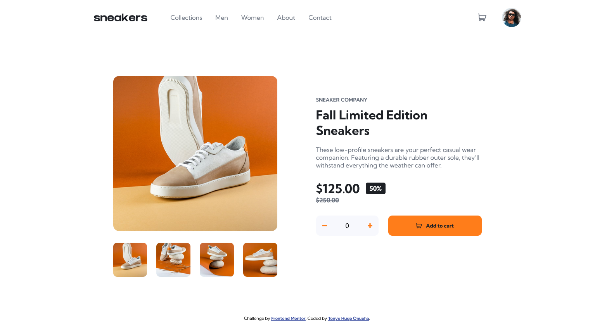

# 🛍️ Frontend Mentor - E-commerce Product Page Solution

This is a solution to the
[E-commerce product page challenge on Frontend Mentor](https://www.frontendmentor.io/challenges/ecommerce-product-page-UPsZ9MJp6).
Frontend Mentor challenges help you improve your coding skills by building realistic projects.

---

## 📑 Table of contents

- [Overview](#overview)
  - [Screenshot](#screenshot)
  - [Links](#links)
- [My process](#my-process)
  - [Built with](#built-with)
  - [Useful resources](#useful-resources)
- [Author](#author)

---

## 🔎 Overview

This is a simple HTML, CSS, and JavaScript project in which the main objective is to build out an **E-commerce product
page**.

### 📸 Screenshot

### 🔗 Links

- **Live Site URL:** [Vercel](https://e-commerce-product-page-flame-six.vercel.app)

---

## 🛠️ My process

The process was very straightforward. I started by writing out the structure of my HTML.
I then created a CSS stylesheet and broke down the styling of elements one piece at a time using the **flexbox layout
model**, while following the **mobile-first approach**.

To complete the layout, I wrote the **media queries** for the desktop design.
After the design was completed, I added the **logic and interactivity** of the page using JavaScript.

---

## 🧰 Built with

- Semantic HTML5 markup
- CSS custom properties
- Flexbox layout model
- Media queries
- JavaScript programming language

---

## 📚 Useful resources

- [W3Schools](https://www.w3schools.com/)

---

## 👨‍💻 Author

- **Email Address:** [tonyeonuoha@gmail.com](mailto:tonyeonuoha@gmail.com)
